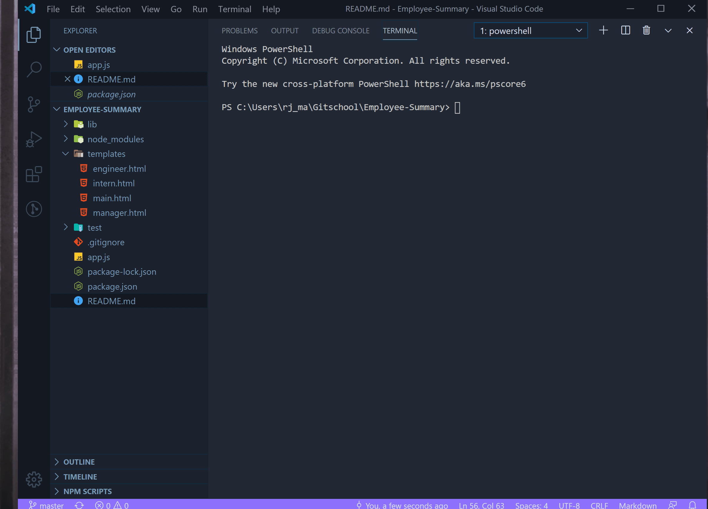

# Employee-Summary

```
A Node CLI to enter information about employees.
```

## Table of Contents

* [User Story](#User-Story)
* [Build Status](#Build-Status)
* [Installation](#Installation)
* [Usage](#Usage)
* [Built With](#Built-with)
* [Test Results](#Results)
* [Final Product](#Final-Product)
* [Author](#Author)

## User Story

```
AS a Manager
I WANT to crate a webpage to display my teams info
SO THAT I can access their emails, github profiles, and see what schools our interns attended
```

## Build Status

Testing phase passed
Production code pushed on March 27, 2020

## Installation

To get started go to https://github.com/RichardKessler/Employee-Summary<br/>
To run tests open the terminal and type 
```
npm i
```

## Usage

After you have installed the modules you can enter the command `npm run test` to run the testing scripts.  You can also enter `node app.js` to run the program in your terminal.  Then open the newly created HTML file to view the webpage.

## Built With

* HTML5
* CSS3
* JavaScript
* Node.js
* ES6
* [Inquirer](https://www.npmjs.com/package/inquirer)
* [Jest](https://www.npmjs.com/package/jest)
* Visual Studio Code

## Results

The test results that needed to pass before production launch.


## Final Product

The final product after all tests are passed and the application is run in the terminal.
